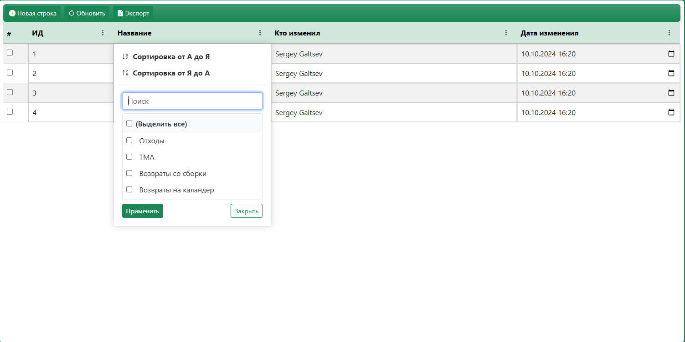

# Vue Table Plugin

Мощный и гибкий компонент таблицы для Vue.js 3 с расширенными возможностями редактирования, фильтрации и пагинации.



## 🌟 Возможности

- **📊 Умное отображение данных** - Адаптивная таблица с автоматической подстройкой под размер экрана
- **✏️ Редактирование на лету** - Изменение данных прямо в ячейках таблицы
- **🔍 Фильтрация и сортировка** - Мощная система фильтрации по колонкам
- **📑 Пагинация** - Настраиваемая пагинация с адаптивным количеством элементов
- **🔄 CRUD операции** - Полная поддержка создания, чтения, обновления и удаления записей
- **📤 Экспорт данных** - Экспорт в Excel одним кликом
- **🎨 Bootstrap стили** - Интеграция с Bootstrap 5 и Bootstrap Icons
- **📱 Адаптивность** - Полная поддержка мобильных устройств

## 🚀 Установка

Перед началом необходимо установить требуемые зависимости

```bash
npm install vue@next bootstrap bootstrap-icons xlsx moment
```

### Установка через npm/git

```bash
npm install git+https://github.com/galtsev001/vue-table-plugin.git#main
```

### Использование

Установка в main.js

```bash
// main.js
import { createApp } from 'vue'
import App from './App.vue'
import VueTablePlugin from 'vue-table-plugin'
import 'bootstrap/dist/css/bootstrap.min.css'
import 'bootstrap-icons/font/bootstrap-icons.css'

const app = createApp(App)
app.use(VueTablePlugin)
app.mount('#app')
```

Подключение компонента

```bash
<template>
  <div class="container mt-4">
    <VueTable
      :initialData="tableData"
      :settings="tableSettings"
      :links="tableLinks"
      table="users"
      :enablePagination="true"
      :itemsPerPage="10"
      @update-data="handleUpdate"
      @new-data="handleCreate"
      @delete-data="handleDelete"
      @refresh-data="handleRefresh"
    />
  </div>
</template>

<script>
export default {
  data() {
    return {
      tableData: [
        { id: 1, name: 'Иван Иванов', email: 'ivan@mail.com', role: 1, created_at: '2024-01-15' },
        { id: 2, name: 'Петр Петров', email: 'petr@mail.com', role: 2, created_at: '2024-01-16' }
      ],
      
      tableSettings: [
        {
          name_column: 'ID',
          name_column_db: 'id',
          type_data: 'int',
          column_order: 1
        },
        {
          name_column: 'Имя',
          name_column_db: 'name',
          type_data: 'string',
          column_order: 2
        },
        {
          name_column: 'Email',
          name_column_db: 'email',
          type_data: 'string',
          column_order: 3
        },
        {
          name_column: 'Роль',
          name_column_db: 'role',
          type_data: 'int',
          column_order: 4
        },
        {
          name_column: 'Дата создания',
          name_column_db: 'created_at',
          type_data: 'DateTime',
          column_order: 5
        }
      ],
      
      tableLinks: [
        {
          link_column: 'role',
          value: {
            1: 'Администратор',
            2: 'Пользователь',
            3: 'Гость'
          }
        }
      ]
    }
  },
  
  methods: {
    handleUpdate(updatedData) {
      console.log('Обновленные данные:', updatedData)
      // Отправка на сервер
    },
    
    handleCreate(newData) {
      console.log('Новые данные:', newData)
      // Создание на сервере
    },
    
    handleDelete(deletedData) {
      console.log('Удаленные данные:', deletedData)
      // Удаление на сервере
    },
    
    handleRefresh() {
      console.log('Обновление данных...')
      // Загрузка свежих данных
    }
  }
}
</script>
```